----

# Elastic-Cloud-Solution-project

## Elastic Cloud Solution: VPC Peering, EFS, Auto Scaling, SESSION Manager and Load Balancer for Resilient and Efficient Applications using aws management console

**Project Overview:**
- **Objective:** Establish a robust and scalable architecture across two Virtual Private Clouds (VPCs) on a cloud platform.
- **Key Components:**
  - VPC Peering Connection
  - Elastic File System (EFS)
  - Auto Scaling Group
  - Target Group
  - Application Load Balancer (ALB)

----

**Project Steps:**

1. **VPC Setup:**
    - Create VPCs: VPC-A (for EFS) and VPC-B (for Auto Scaling).
----

# Create VPCs: VPC-A (for EFS) and VPC-B (for Auto Scaling)

## Overview
This guide outlines the steps to create two Virtual Private Clouds (VPCs) - VPC-A and VPC-B, each serving specific purposes. VPC-A is designed to host Amazon Elastic File System (EFS), while VPC-B is intended for Auto Scaling applications.

## VPC-A (for EFS)
- 
### Steps
1. **Create VPC**
   - Set up a new VPC with a unique CIDR block.
  
2. **Subnets**
   - Establish public and private subnets within VPC-A.
   - Allocate appropriate CIDR blocks to these subnets.

3. **Internet Gateway**
   - Attach an Internet Gateway to enable communication with the internet.

4. **Route Tables**
- 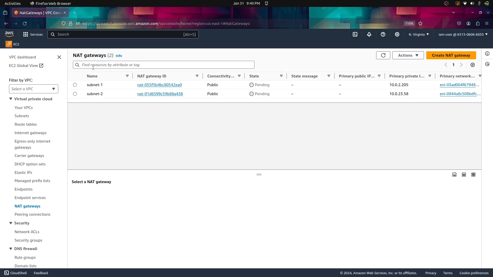
   - Configure route tables for both public and private subnets.
   - Associate the public subnet with the Internet Gateway.

5. **Security Groups**
   - Define security groups to control inbound and outbound traffic.
   - Allow necessary traffic for EFS.

----

## VPC-B (for Auto Scaling)
- 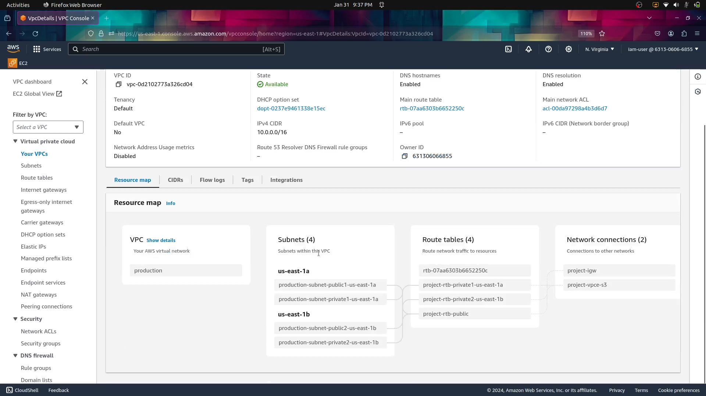

### Steps
1. **Create VPC**
   - Establish a new VPC with a distinct CIDR block.

2. **Subnets**
   - Create public and private subnets within VPC-B.
   - Allocate appropriate CIDR blocks to these subnets.

3. **Internet Gateway**
   - Attach an Internet Gateway to allow communication with the internet.

4. **Route Tables**
   - Configure route tables for public and private subnets.
   - Associate the public subnet with the Internet Gateway.

5. **Security Groups**
   - Define security groups to regulate inbound and outbound traffic.
   - Allow necessary traffic for Auto Scaling applications.

- 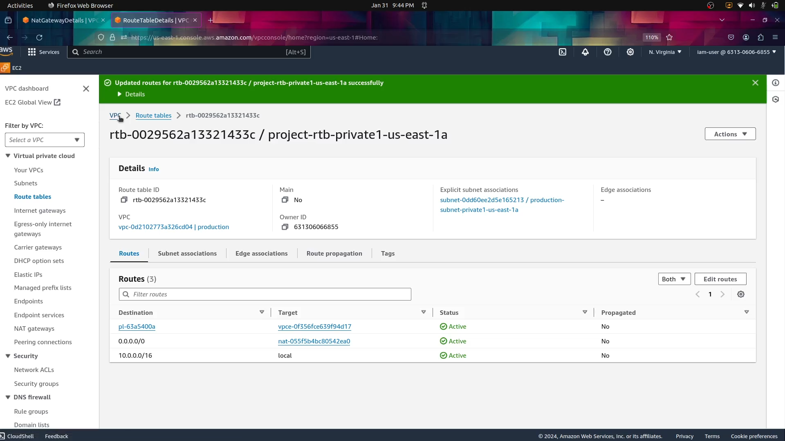

----

# Setting Up VPC Peering Connections Using AWS Management Console

## Getting Started

- 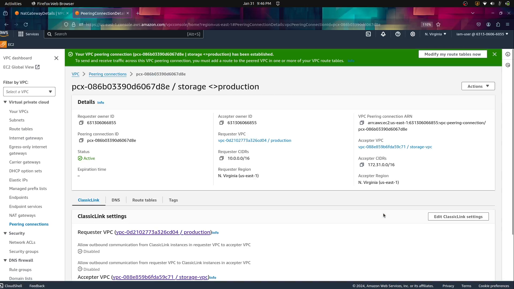

1. **Access AWS Management Console:**
   Log in to the AWS Management Console.

2. **Navigate to VPC Dashboard:**
   Go to the VPC Dashboard from the AWS Management Console.

3. **Create Peering Connection:**
   Follow the on-screen instructions to create a new VPC peering connection.

4. **Configure Peering Connection:**
   Provide the necessary details, including the IDs of the VPCs you want to connect.

5. **Accept Peering Connection:**
   In the target VPC, accept the peering connection request.
   
- 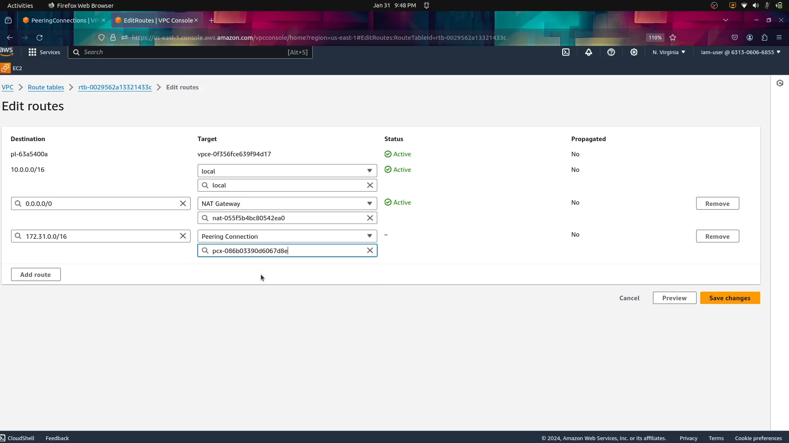
- 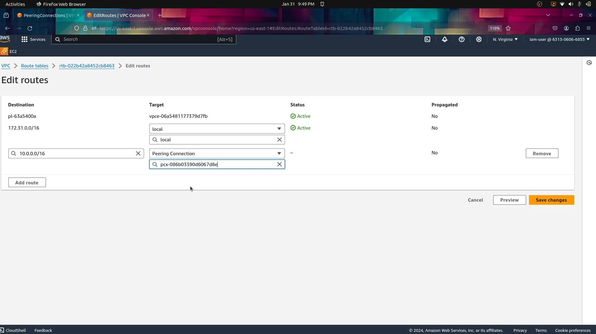

7. **Verify Connection:**
   Validate the status of the VPC peering connection in the AWS Management Console.

## Additional Resources

Explore more about VPC peering and related technologies through the official AWS documentation:

- [AWS VPC Peering Documentation](https://docs.aws.amazon.com/vpc/latest/peering/what-is-vpc-peering.html)

----
2. **EFS Configuration:**

## Getting Started

1. **Access AWS Management Console:**
   Log in to the AWS Management Console.

2. **Navigate to EFS Dashboard:**
   Go to the Elastic File System (EFS) Dashboard from the AWS Management Console.

3. **Create File System:**
   Follow the on-screen instructions to create a new Amazon EFS file system.
- 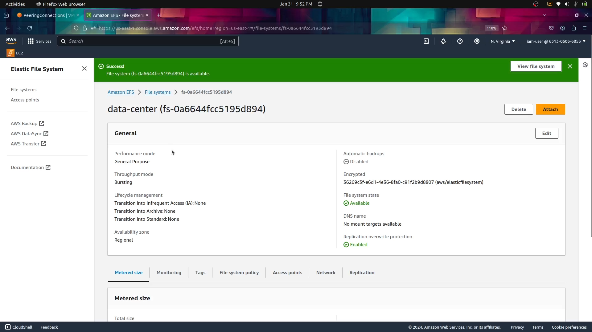

4. **Configure File System:**
   Provide the necessary details, including the VPC, security groups, and subnet IDs.

- 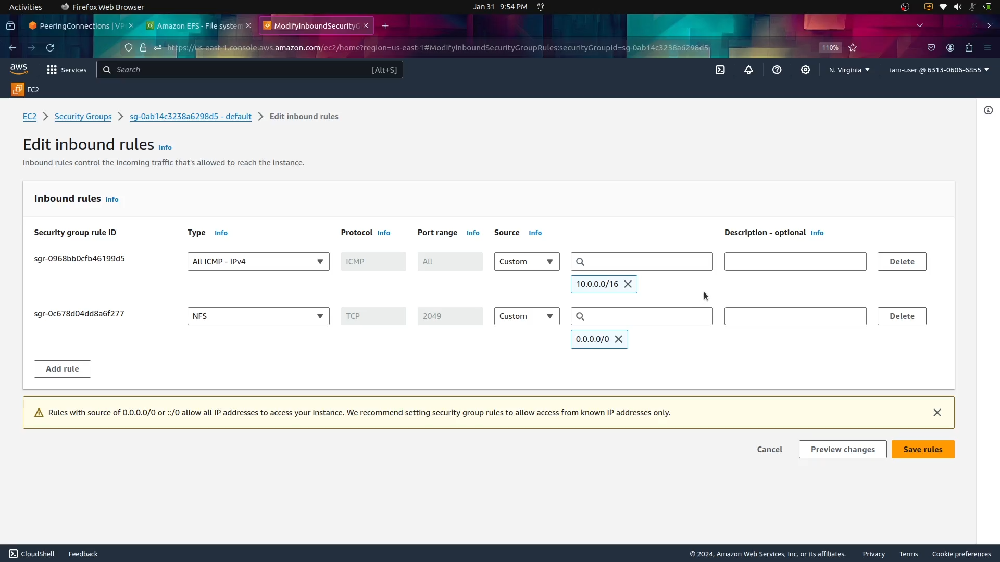
- 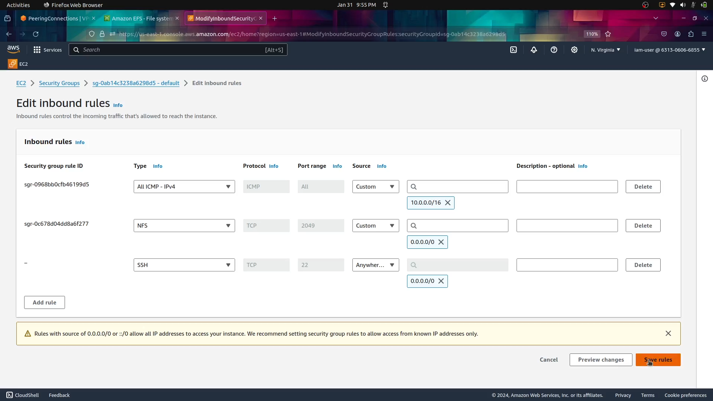

5. **Configure Access Points (Optional):**
   Set up access points to manage file access more granularly if needed.
- 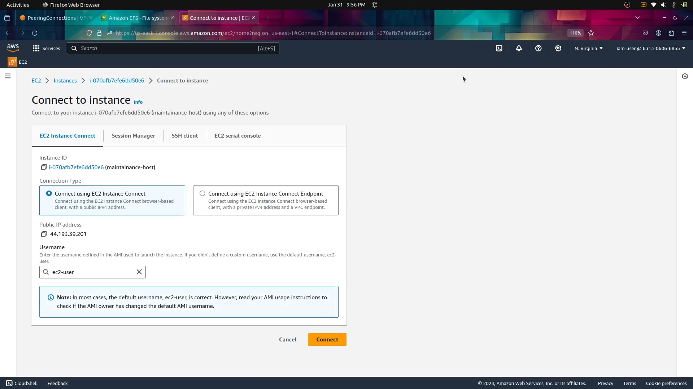
- 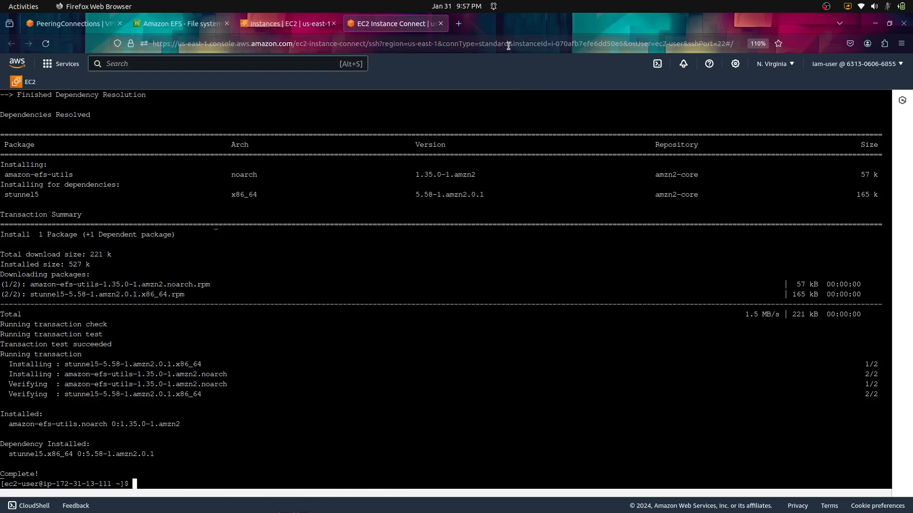

7. **Mount File System:**
   Obtain the DNS name for your EFS file system and mount it to your EC2 instances or on-premises servers.

- 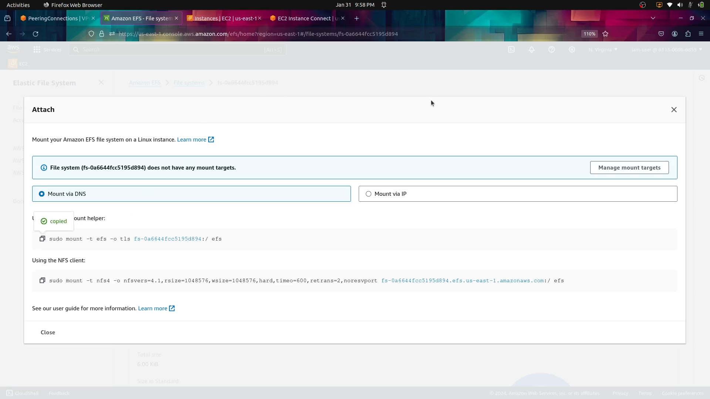
- 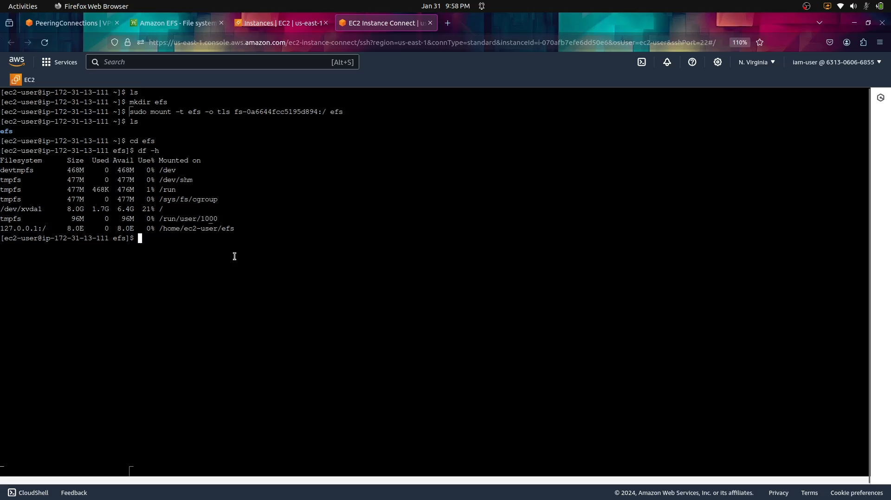
## Additional Resources

Explore more about Amazon EFS and related technologies through the official AWS documentation:

- [Amazon EFS Documentation](https://docs.aws.amazon.com/efs/latest/ug/whatisefs.html)

----

# Creating AWS Launch Template

## Getting Started

1. **Access AWS Management Console:**
   Log in to the AWS Management Console.

2. **Navigate to EC2 Dashboard:**
   Go to the EC2 Dashboard from the AWS Management Console.
- 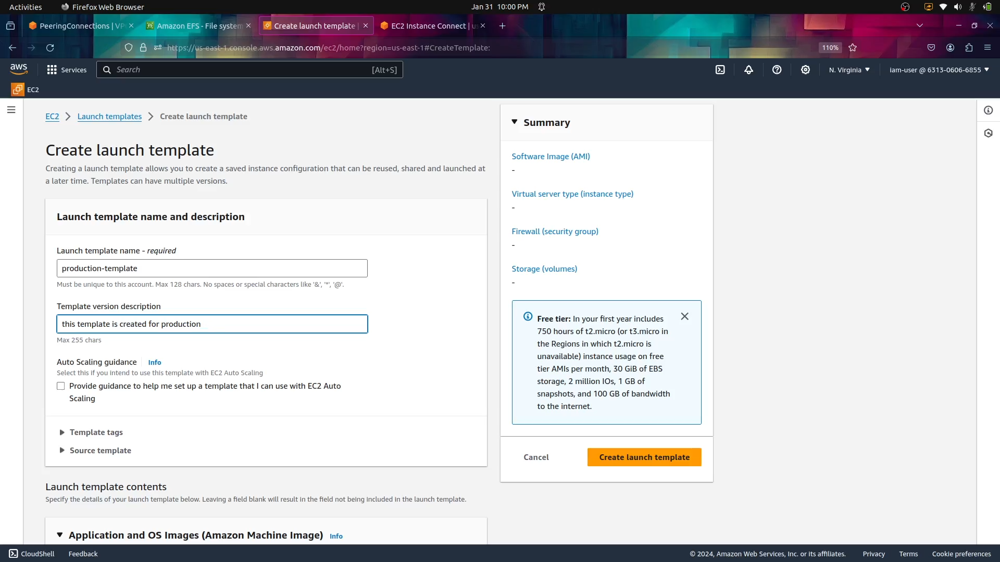

3. **Create Launch Template:**
   - In the navigation pane, select "Launch Templates."
   - Click the "Create Launch Template" button.

4. **Configure Template:**
   - Provide a name and description for your launch template.
   - Configure the instance details, including the Amazon Machine Image (AMI), instance type, and key pair.
   - Set other configuration options, such as networking, storage, and IAM role.

5. **Add User Data (Optional):**
   - Include user data scripts or configuration to be executed when the instance launches.

- 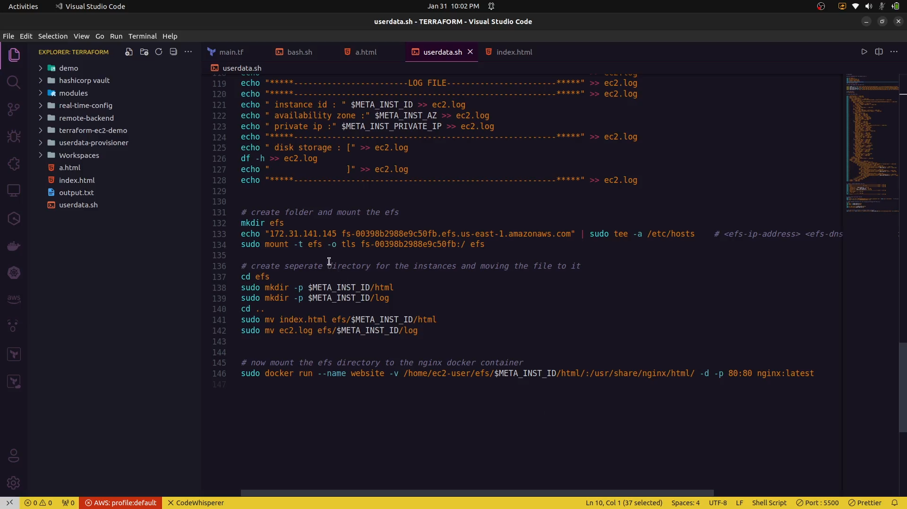
- 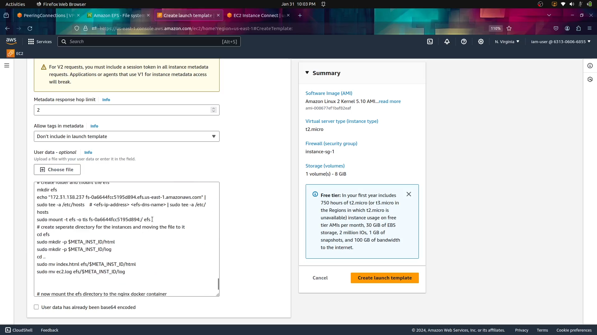

6. **Configure Advanced Settings (Optional):**
   - Customize advanced settings like monitoring, T2/T3 unlimited mode, and instance termination protection.

7. **Review and Create:**
   - Review your launch template configuration.
   - Click "Create launch template."

## Using the Launch Template

1. **Launch Instances:**
   - In the EC2 Dashboard, click "Launch Instances" and choose "Launch from template."
   - Select the launch template you created.

2. **Configure Instance Details:**
   - Customize any additional settings for your instances, if needed.

3. **Review and Launch:**
   - Review your configuration and click "Launch" to deploy instances using the launch template.
- 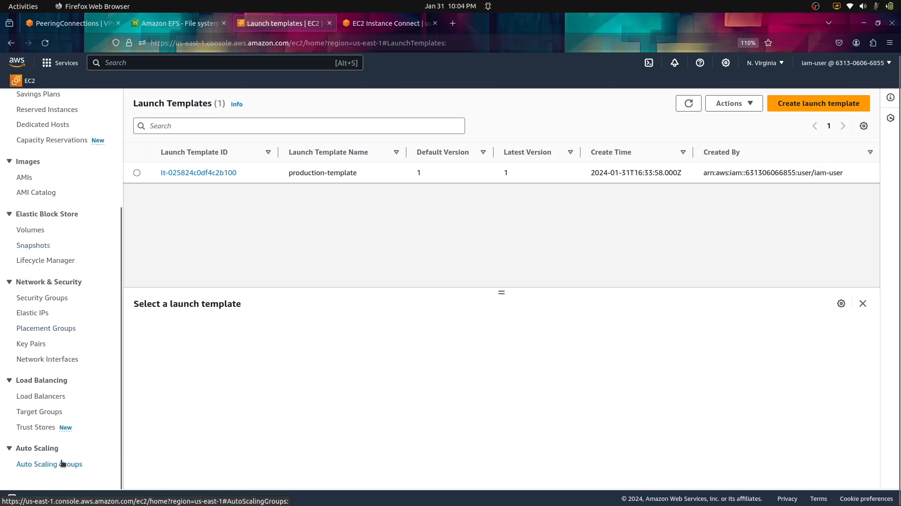

## Additional Resources

Explore more about AWS Launch Templates and related technologies through the official AWS documentation:

- [AWS Launch Templates Documentation](https://docs.aws.amazon.com/AWSEC2/latest/UserGuide/ec2-launch-templates.html)

----
# Auto Scaling Setup:
   - Configure a launch configuration with necessary AMI and user data in VPC-B.
   - Create an Auto Scaling Group in the private subnet of VPC-B.
   - Use the VPC peering connection for cross-VPC communication
- 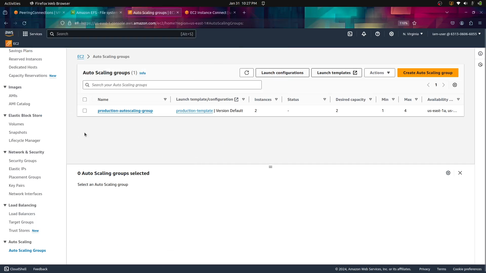

# AWS Auto Scaling Quick Setup

1. **Create Launch Configuration:**
   - In EC2 Dashboard, create a launch configuration.

2. **Set Up Auto Scaling Group (ASG):**
   - In EC2 Dashboard, create an Auto Scaling Group.

3. **Configure Scaling Policies:**
   - Define scaling policies for conditions like CPU utilization.

4. **Set Desired Capacity:**
   - Specify the desired number of instances.

5. **Monitor and Test:**
   - Use AWS CloudWatch to monitor activities.
   - Test scaling events for functionality.

6. **Cleanup:**
   - Use the AWS Console to delete or modify resources.

**Resources:**
[Auto Scaling Documentation](https://docs.aws.amazon.com/autoscaling/).

   

----

# AWS Session Manager Quick Setup

1. **Access AWS Management Console:**
   - Log in to the AWS Management Console.

2. **Navigate to Session Manager:**
   - In the AWS Systems Manager console, select "Session Manager."
 
- 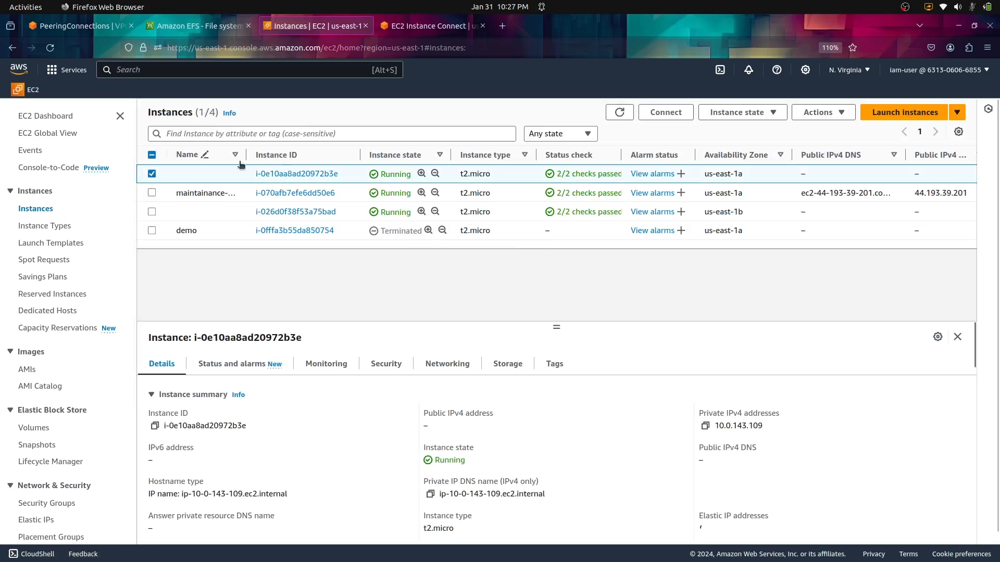

3. **Start a Session:**
   - Choose an instance and start a session without SSH/RDP.

4. **Interact with the Instance:**
   - Gain interactive shell access to the instance without direct connectivity.
  
- 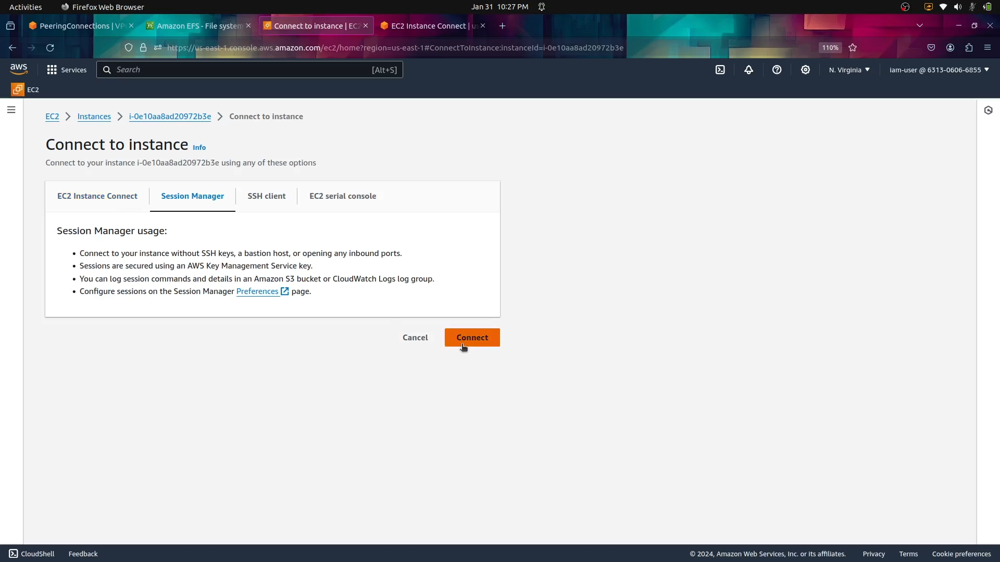
5. **Review and Terminate Sessions:**
   - Monitor active sessions and terminate them when necessary.

6. **Enhanced Security:**
   - Leverage Session Manager's secure and auditable session access.
- 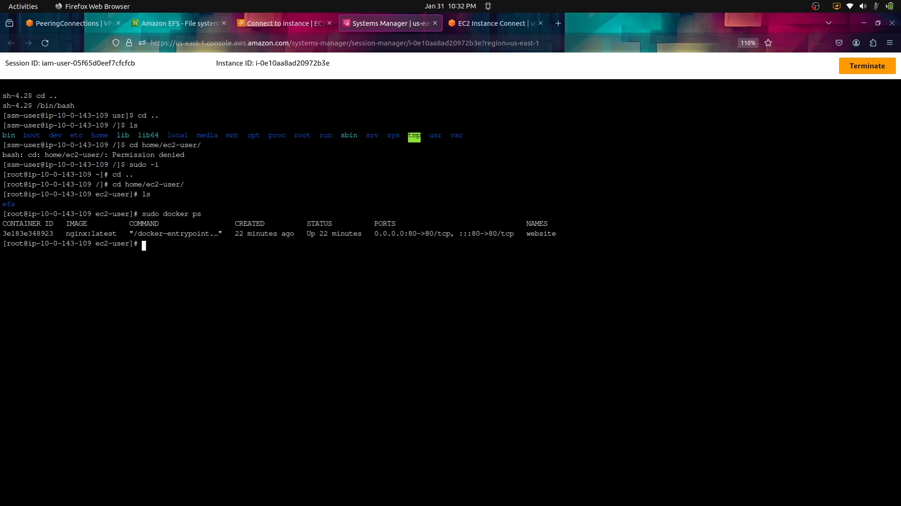

**Mounting EFS in Auto Scaling Instances:**
   - Update user data in the launch configuration to mount the EFS file system on Auto Scaling instances.

**Resources:**
Explore more in the [AWS Session Manager Documentation](https://docs.aws.amazon.com/systems-manager/latest/userguide/session-manager.html).

   

----
# AWS Application Load Balancer Quick Setup

1. **Access AWS Management Console:**
   - Log in to the AWS Management Console.

2. **Navigate to EC2 Dashboard:**
   - In the EC2 Dashboard, select "Load Balancers."

- 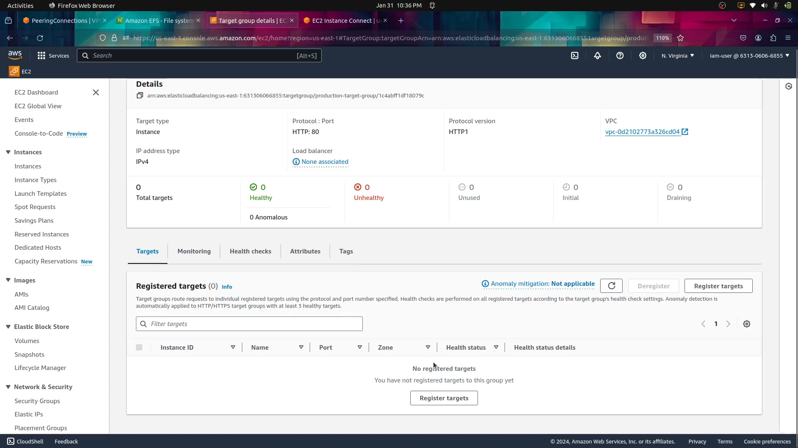
- 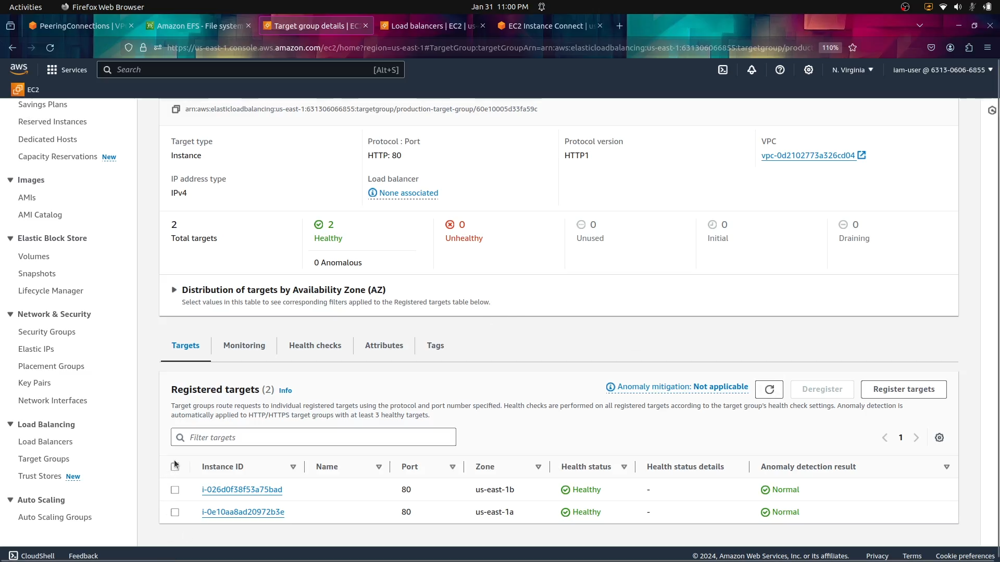
3. **Create Application Load Balancer (ALB):**
   - Click "Create Load Balancer" and choose "Application Load Balancer."

- 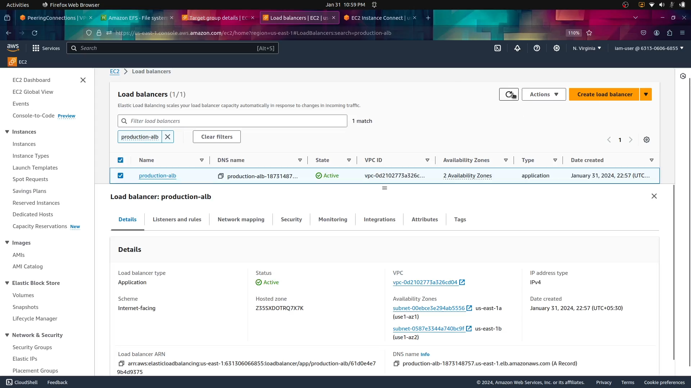

4. **Configure ALB Settings:**
   - Define the load balancer name, scheme, listeners, and availability zones.

5. **Configure Security Settings (Optional):**
   - Set up security policies and configure SSL termination if needed.

6. **Configure Routing:**
   - Define target groups and routing rules for forwarding traffic to instances.

7. **Review and Create:**
   - Review the ALB configuration and click "Create Load Balancer."

**Resources:**
Explore more in the [AWS ALB Documentation](https://docs.aws.amazon.com/elasticloadbalancing/latest/application/introduction.html).

----

7. **Testing and Monitoring:**
   - Validate the connectivity between EFS in VPC-A and Auto Scaling instances in VPC-B.
   - Monitor the performance and scaling behavior of the Auto Scaling Group.
   - Ensure the load balancer distributes traffic effectively among Auto Scaling instances.
   
- 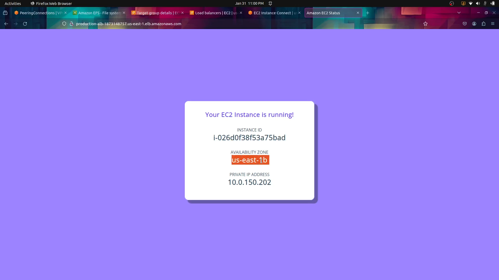
- 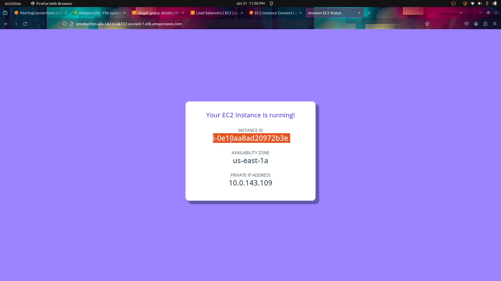

----
8. **Documentation and Deployment Guide:**
   - Prepare comprehensive documentation detailing the architecture, configurations, and deployment steps.
   - Include troubleshooting guidelines and best practices.
     
- 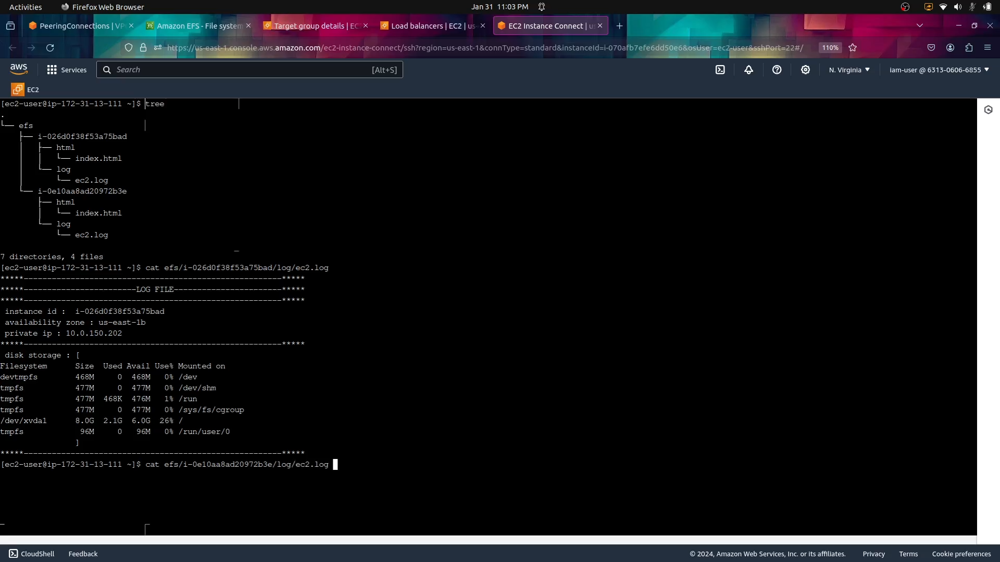
- 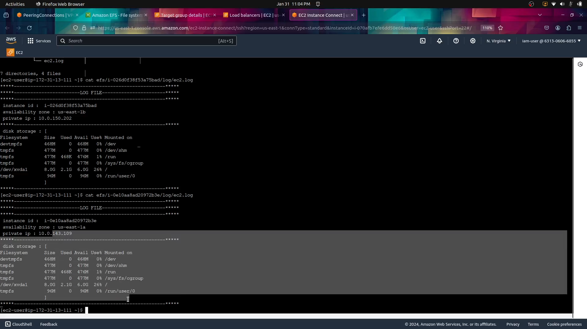

----

**Conclusion:**
Successfully implementing this project will result in a resilient and scalable cloud architecture, utilizing VPC peering for secure communication, EFS for shared file storage, Auto Scaling for dynamic resource management, and an ALB for distributing incoming traffic across instances.

----

