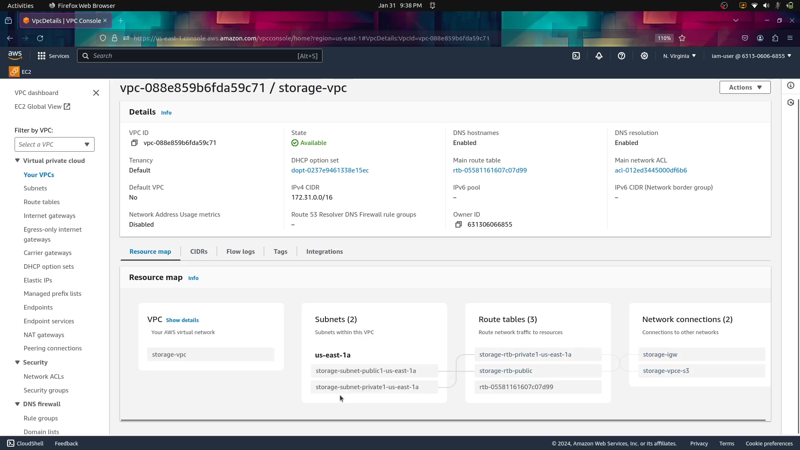

----

# Elastic-Cloud-Solution-project

## Elastic Cloud Solution: VPC Peering, EFS, Auto Scaling, SESSION Manager and Load Balancer for Resilient and Efficient Applications using aws management console

**Project Overview:**
- **Objective:** Establish a robust and scalable architecture across two Virtual Private Clouds (VPCs) on a cloud platform.
- **Key Components:**
  - VPC Peering Connection
  - Elastic File System (EFS)
  - Auto Scaling Group
  - Target Group
  - Application Load Balancer (ALB)

----

**Project Steps:**
1. **VPC Setup:**
    - Create VPCs: VPC-A (for EFS) and VPC-B (for Auto Scaling).

----

   - Configure VPC Peering Connection between VPC-A and VPC-B.

----
2. **EFS Configuration:**
   - Create an Elastic File System (EFS) in VPC-A.
 

- Set up security groups and network ACLs to allow communication with VPC-B.

----
3. **Auto Scaling Setup:**
   - Configure a launch configuration with necessary AMI and user data in VPC-B.
   - Create an Auto Scaling Group in the private subnet of VPC-B.
   - Use the VPC peering connection for cross-VPC communication
   

----
4. **Mounting EFS in Auto Scaling Instances:**
   - Update user data in the launch configuration to mount the EFS file system on Auto Scaling instances.
   

----
5. **Session manager:**
   - using the Session manager we can login to the private subnet ec2 without key pairs,inbound rules and ssh to it.
   

----
 **Load Balancing:**
   - Set up a Target Group in VPC-B.
   - Create an Application Load Balancer (ALB) in the public subnet of VPC-B.
   - Configure the ALB to use the Target Group.
   - 

----

7. **Testing and Monitoring:**
   - Validate the connectivity between EFS in VPC-A and Auto Scaling instances in VPC-B.
   - Monitor the performance and scaling behavior of the Auto Scaling Group.
   - Ensure the load balancer distributes traffic effectively among Auto Scaling instances.
   

----
8. **Documentation and Deployment Guide:**
   - Prepare comprehensive documentation detailing the architecture, configurations, and deployment steps.
   - Include troubleshooting guidelines and best practices.
     

----

**Conclusion:**
Successfully implementing this project will result in a resilient and scalable cloud architecture, utilizing VPC peering for secure communication, EFS for shared file storage, Auto Scaling for dynamic resource management, and an ALB for distributing incoming traffic across instances.

----

